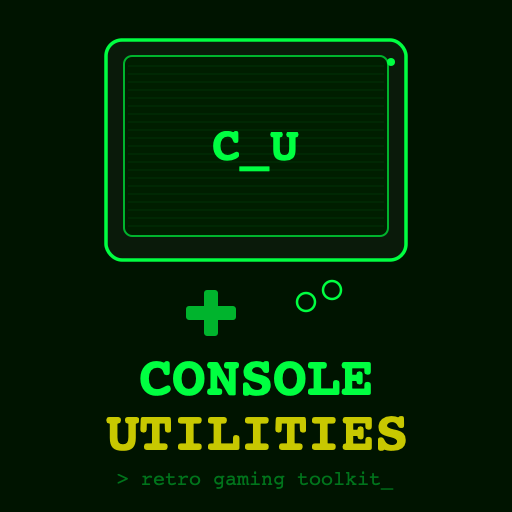
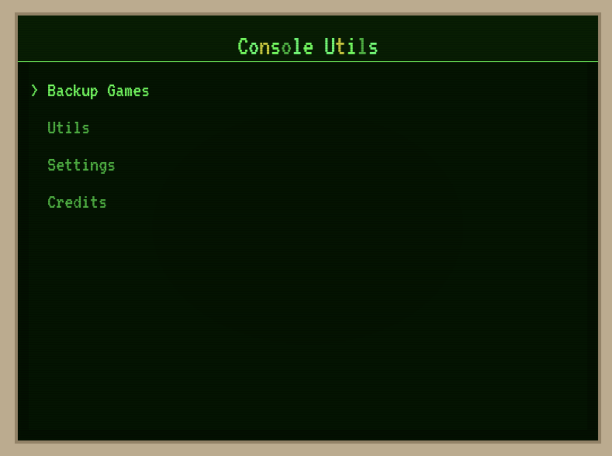

# Console Utilities

<div align="center">
  
  <br><br>
  <a href="https://hiitsgabe.github.io/console_utilities/">🌐 Website</a> &middot;
  <a href="https://github.com/hiitsgabe/console_utilities/releases">📦 Downloads</a>
</div>
<br><br>



> **Disclaimer:** This application does not endorse any form of piracy. Only download games you legally own.

A PyGame utility suite for handheld gaming consoles, with a retro CRT interface built for a D-pad and a controller. Point it at a source, browse what's there, and it downloads the files and drops them where your frontend expects them. It reads plain HTML directory listings, JSON APIs, and the Internet Archive.

It's built for low-end Linux handhelds: Batocera, Knulli, and Rocknix. That shapes everything about it. 800x600, controller and keyboard only, no mouse, no touch, and no desktop environment assumed.

If you're on Android or macOS, use [retro_toolbox](https://github.com/hiitsgabe/retro_toolbox) instead. This one won't run there.

---

## Features

### Downloading

Select as many games as you like and they go into a queue with live progress, speed, and ETA. If a download dies halfway through, it picks up where it stopped instead of starting over. ZIP and RAR archives are extracted into the right system folder on their own, and NSZ files get converted to NSP along the way.

### Browsing

List view, or a grid with box art. Search within a system, filter to USA releases with a per-system regex, and optionally hide anything you already have.

### Sports ROM patcher

Pulls rosters from ESPN, or historical ones from the public hockey API going back to 1993, and writes them into a ROM you already own. Ten games are covered across soccer, basketball, baseball, and hockey, on PS1, PS2, PSP, SNES, and Genesis.

The flow is the same every time: fetch the rosters, look them over, point it at your ROM, patch. Soccer adds a league picker and a step for team colors. Hockey adds a season selector. Real stats get mapped onto whatever attribute scale the game uses, and team names, kits, and flags are updated where the format allows it. Your original file is never touched: the patched copy is written next to it.

There's more detail in the [Sports ROM Patcher Guide](docs/sports-rom-patcher.md).

### Utilities

- **Steam shortcut creator.** Search Steam, browse the results by banner, pick a folder, and write `.steam` shortcut files for ES-DE frontends on Android.
- **Direct URL download.** Paste a URL, get the file.
- **Internet Archive.** Grab individual files, or add an entire collection as a system.
- **Deduplication.** Find and remove duplicates, with a safe mode and a fuzzy one.
- **Filename cleanup.** Batch rename files into something readable.
- **Ghost file cleaner.** Track down orphaned split archives.
- **Extraction.** Unpack ZIP and RAR files straight from the file browser.

### Systems

Add a system by pointing the app at a directory listing and letting it discover what's there, or configure one by hand. Each system can have its own ROM folder and can be hidden from the menu. HTML listings, JSON APIs, and the Internet Archive metadata API all work, and you can attach bearer tokens, cookies, or IA S3 credentials when a source needs them.

### Interface

Phosphor green, scanlines, vignette, the whole CRT thing. Full D-pad and gamepad support, with acceleration when you hold a direction. There's also a web companion: switch it on and you can drive the entire app from a phone or laptop on the same network, with a live mirror of the screen, a file manager, and the log viewer. App updates can be checked and installed without leaving the app.

---

## Installation

### On a Linux desktop

Grab `linux.zip` from the [releases page](https://github.com/hiitsgabe/console_utilities/releases), extract it, and run it. Python and every library are inside the folder, so there's nothing else to install.

```bash
unzip linux.zip
./console_utilities/console_utilities
```

x86_64 with glibc 2.35 or newer. More detail in the [Linux guide](assets/docs/linux.md).

### Development setup

```bash
# Setup conda environment and install dependencies
make setup

# Run with auto-restart on file changes
make run

# Run without auto-restart (full error logs)
make debug
```

Or manually:

```bash
conda env create -f environment.yml
conda activate console_utilities
pip install -e .[dev]
DEV_MODE=true python src/app.py
```

### On a console (Batocera/Knulli)

1. Create a `downloader` folder inside your console's `pygame` roms directory
2. Run `make bundle` to create the distribution package
3. Copy the contents of `dist/pygame.zip` (`console_utils.pygame` plus `assets/`) into that folder
4. Rescan games in EmulationStation
5. Open the PyGame library and launch Console Utilities

### Building

```bash
make bundle            # PyGame bundle for consoles
make bundle-linux      # Standalone Linux binary
make bundle-windows    # Windows .exe standalone
```

The Linux and Windows bundles carry their own Python and their own copy of every library, so there's nothing to install on the target machine. The Linux one is x86_64 and needs glibc 2.35 or newer. On ARM handhelds, use the pygame bundle.

---

## Configuration

### System sources (`bundled_data.json`)

Systems live in JSON files that say where to find the files and how to read the server's response. Two docs cover this:

- [Server Response Format](docs/server-response-format.md), what your server has to return for the app to see any files
- [Adding a System](docs/adding-a-system.md), how to wire up a custom source

### User settings (`config.json`)

Written automatically the first time you change something. It holds:

- **Directories.** Working directory, ROMs directory.
- **Display.** Box art thumbnails, USA-only filter, skip installed games.
- **Internet Archive.** On or off, plus S3 credentials.
- **Sports roster.** On or off, and which hockey data source to use (ESPN or the public hockey API).
- **Web companion.** On or off.
- **NSZ.** On or off, and the path to your keys file.

---

## Controls

### System selection
| Input | Action |
|-------|--------|
| D-pad up/down, arrow keys | Navigate systems |
| B button, Enter | Select system |
| A button, Escape | Exit application |
| SELECT | Toggle list/grid view |

### Game selection
| Input | Action |
|-------|--------|
| D-pad up/down, arrow keys | Navigate games |
| D-pad left/right, Page Up/Down | Jump by letter |
| B button, Space | Toggle game selection |
| A button, Escape | Return to systems |
| START, Enter | Begin download |
| SELECT | Toggle view/thumbnails |

While a download is running, A or Escape cancels it. Progress, speed, and ETA update live.

---

## Project structure

```
console_utilities/
├── src/
│   ├── app.py                          # Main application entry point
│   ├── state.py                        # Centralized state management
│   ├── constants.py                    # Global constants and paths
│   ├── config/
│   │   └── settings.py                # User settings persistence
│   ├── services/
│   │   ├── data_loader.py            # System/game data loading
│   │   ├── download_manager.py       # Download queue management
│   │   ├── file_listing.py           # Remote file listing (HTML/JSON/IA)
│   │   ├── image_cache.py            # Thumbnail caching
│   │   ├── installed_checker.py      # Local file detection
│   │   ├── internet_archive.py       # Internet Archive API
│   │   ├── sports_api/              # ESPN and NHL roster clients
│   │   ├── rom_finder.py            # Auto-detect a ROM on disk
│   │   ├── team_color_cache.py      # Team color overrides
│   │   ├── we_patcher/              # PS1 soccer ROM patcher
│   │   ├── iss_patcher/             # SNES soccer ROM patcher
│   │   ├── pes6_ps2_patcher/        # PS2 soccer ISO patcher
│   │   ├── nbalive95_patcher/       # Genesis basketball ROM patcher
│   │   ├── kgj_mlb_patcher/         # SNES baseball ROM patcher
│   │   ├── mvp_psp_patcher/         # PSP baseball ISO patcher
│   │   ├── nhl94_genesis_patcher/   # Genesis hockey ROM patcher
│   │   ├── nhl94_snes_patcher/      # SNES hockey ROM patcher
│   │   ├── nhl05_ps2_patcher/       # PS2 hockey ISO patcher
│   │   └── nhl07_psp_patcher/       # PSP hockey ISO patcher
│   ├── web_companion/                 # Browser remote control and file manager
│   ├── input/
│   │   ├── controller.py             # Controller/gamepad input
│   │   └── navigation.py             # D-pad navigation with acceleration
│   ├── ui/                            # UI components (Atomic Design)
│   │   ├── theme.py                  # Design tokens and theming
│   │   ├── atoms/                    # Basic components
│   │   ├── molecules/                # Composite components
│   │   ├── organisms/                # Complex sections
│   │   ├── templates/                # Page layouts
│   │   └── screens/                  # Complete screens and modals
│   ├── utils/                         # Logging, formatting, NSZ wrapper
│   └── nsz/                           # Embedded NSZ library
├── assets/
│   ├── bundled_data.json             # System configuration
│   ├── docs/                         # Platform-specific build docs
│   ├── examples/                     # Example configuration files
│   ├── fonts/                        # VT323 retro font
│   └── images/                       # Logo and screenshots
├── docs/                              # User documentation
├── workdir/                           # Development runtime data
├── dist/                              # Built distributions
├── Makefile                           # Build and development commands
├── environment.yml                    # Conda environment specification
├── pyproject.toml                     # Python project configuration
└── README.md
```

---

## Dependencies

- Python 3.11+
- pygame >= 2.0.0
- requests >= 2.25.0
- rarfile >= 4.0 (bundled for console)
- Pillow >= 9.0.0
- [retro-roster-patcher](https://github.com/hiitsgabe/retro_roster_patcher) >= 0.1.0, the sports patching engine
- watchdog (development only)
- black, flake8, pytest (development only)

## Compatibility

| Platform | Details |
|----------|---------|
| Primary target | Low-end Linux handhelds: Knulli RG35xxSP, Batocera, and Rocknix devices |
| Linux desktop | Standalone x86_64 binary (`linux.zip`), or run from source |
| Windows | Standalone .exe bundle |
| Android, macOS | Not supported. Use [retro_toolbox](https://github.com/hiitsgabe/retro_toolbox) |
| Display | 800x600, tuned for small screens |

---

## Documentation

- [Sports ROM Patcher Guide](docs/sports-rom-patcher.md), how the roster patcher works
- [Server Response Format](docs/server-response-format.md), what your server has to return
- [Adding a System](docs/adding-a-system.md), wiring up a custom source
- [PyGame Bundle Guide](assets/docs/pygame.md), deploying to Batocera/Knulli
- [Linux Build Guide](assets/docs/linux.md), the standalone Linux binary
- [Windows Build Guide](assets/docs/windows.md), building the standalone Windows app

---

## Legal notice and disclaimer

**Please read this.**

- **No ROM data storage.** This project does not host, store, or distribute ROM files, game data, or copyrighted content of any kind. It is a download manager and a patching tool, nothing else.

- **No game copies.** The application contains no copies of games, ROMs, ISOs, or any copyrighted gaming content whatsoever.

- **Patching works on your own copies only.** The sports patcher requires you to supply a ROM or ISO you legally obtained from original media you own. This project does not provide, link to, or help you acquire any game files.

- **No affiliation.** This project is not affiliated with, endorsed by, or associated with any game publisher, developer, sports league, or rights holder.

- **Example configuration.** Any configuration files included are examples. They show how the system works; they do not endorse or recommend any particular download source.

- **Your responsibility.** You alone are responsible for:
  - Ensuring you have the legal right to download any content
  - Supplying only legally owned ROM and ISO files for patching
  - Complying with copyright law in your jurisdiction
  - Checking the legality of any source you configure
  - Understanding that downloading copyrighted content without permission may be illegal

- **Third-party sources.** Any site or source referenced in a configuration example is a third-party service. Research and evaluate their legal status yourself.

- **Lawful use only.** This tool is meant for legally owned content, homebrew, and content explicitly cleared for distribution. The patching features are for personal use with games you own.

- **No liability.** The developers and contributors accept no responsibility or liability for misuse of this software. You bear full responsibility for how you use it and for complying with applicable law.

**By using this software you acknowledge these responsibilities and agree to use it only for lawful purposes.**

---

## Credits

- **NSZ library.** Switch file compression and decompression comes from [nicoboss/nsz](https://github.com/nicoboss/nsz).

---

## Troubleshooting

### Logs

Errors go to `error.log` in the application directory:

- On Batocera: `/userdata/roms/pygame/downloader/error.log`
- In development: `py_downloads/error.log` in the project root

### Common issues
| Problem | Solution |
|---------|----------|
| No games showing | Check the system configuration and your network connection |
| Downloads failing | Check free disk space and directory permissions |
| Display problems | Make sure the pygame dependencies are installed |
| Thumbnails not loading | Check that the `boxarts` URL is correct and reachable |

### Development
```bash
make format    # Format code with black
make lint      # Lint code with flake8
make test      # Run tests with pytest
make clean     # Clean build artifacts
```

---

## License

Licensed under [CC BY-NC 4.0](https://creativecommons.org/licenses/by-nc/4.0/). You're free to share, adapt, and build on it for non-commercial purposes, with attribution. See [LICENSE](LICENSE) for the details.

---

## Contributing

Pull requests are welcome, from humans and AI agents alike. For anything big, open an issue first so we can talk it through.

---

Built with vibe coding as a study of what agentic AI can actually do, non-commercial and educational, by hiitsgabe. It's experimental and a bit unstable, I'll never ask you for money, and if you find a bug or have an idea, open an issue. :)
