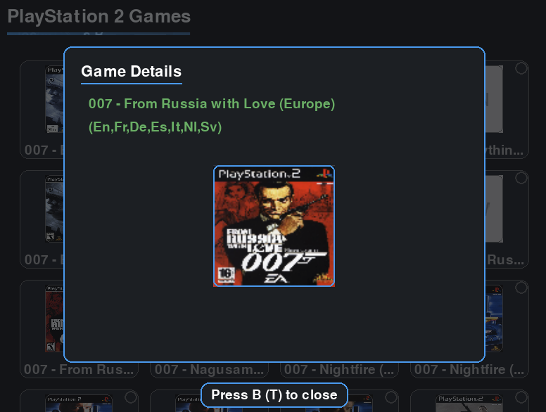

This project is an exercise to test Vibe Coding's capabilities. (CLAUDE)

# Console Utilities

<div align="center">
  
</div>



**Disclaimer: This application does not endorse any form of piracy. Only download games you legally own.**

A PyGame-based console utilities application designed for handheld gaming consoles, tested specifically with Knulli RG35xxSP. Features an interactive menu system with D-pad navigation, real-time download progress, and automatic file organization.

## Features

- **Interactive UI**: PyGame-based interface with D-pad and keyboard navigation
- **Multiple View Modes**: List view and 4-column grid layout
- **Multi-game Selection**: Batch downloading with real-time progress tracking
- **Smart Download Management**: Resume capability and speed indicators
- **Automatic Organization**: File extraction and proper directory structure
- **Image Caching**: Thumbnail loading and caching for file artwork
- **Platform Detection**: Auto-configures paths for Batocera and development environments
- **Comprehensive Logging**: Error tracking and recovery mechanisms
- **NSZ Support**: Built-in NSZ file decompression capability

## Installation

### Development Setup

#### Using Make (Recommended)
```bash
# Setup conda environment and dependencies
make setup

# Run the application with auto-restart on file changes
make run

# Other useful commands
make help      # Show all available commands
make clean     # Clean generated files
make format    # Format code with black
make lint      # Lint code with flake8
make build     # Create distribution package for console
```

#### Manual Setup
```bash
# Create and activate conda environment
conda env create -f environment.yml
conda activate console_utilities

# Install in development mode
pip install -e .[dev]

# Run the application
python src/app.py
```

### Console Installation
1. Create a `downloader` folder inside your console's `pygame` roms directory
2. Use `make build` to create distribution files, then copy `dist/dw.pygame` and `dist/download.json` to the console folder
3. Configure `download.json` with your download sources
4. Rescan games in EmulationStation
5. Navigate to PyGame library and run the downloader

## Configuration

### System Configuration (`assets/config/download.json`)

Configure gaming systems and download sources:

```json
[
  {
    "name": "System Name",
    "url": "https://example.com/roms/system/",
    "file_format": [".iso", ".bin", ".zip"],
    "roms_folder": "system_folder",
    "regex": "href=\"([^\"]*\.(iso|bin|zip))\"",
    "boxarts": "https://example.com/boxart/system/",
    "should_unzip": true
  }
]
```

### Configuration Fields

- `name`: Display name for the gaming system
- `url`: Base URL for ROM directory listing (supports HTML parsing or JSON APIs)
- `file_format`: Array of supported file extensions
- `roms_folder`: Target directory within roms folder
- `regex`: Custom regex for HTML parsing (optional)
- `boxarts`: Base URL for game thumbnails (optional)
- `should_unzip`: Automatically extract ZIP files after download

### User Settings (`config.json`)

Runtime settings are automatically created and stored:
- Display preferences (thumbnails, view type)
- Directory paths (work directory, ROM directory)
- Cache settings and filtering options

## Controls

### Navigation Modes
- **Systems Mode**: Browse available gaming systems
- **Games Mode**: Browse and select games within a system
- **Settings Mode**: Configure application behavior

### System Selection
- **D-pad Up/Down** or **Arrow Keys**: Navigate systems
- **B Button** or **Enter**: Select system
- **A Button** or **Escape**: Exit application
- **SELECT**: Toggle between list and grid view

### Game Selection
- **D-pad Up/Down** or **Arrow Keys**: Navigate games
- **D-pad Left/Right** or **Page Up/Down**: Jump pages or letters
- **B Button** or **Space**: Toggle game selection
- **A Button** or **Escape**: Return to systems
- **START** or **Enter**: Begin download
- **SELECT**: Toggle view type and thumbnail display

### During Download
- **A Button** or **Escape**: Cancel download
- Real-time progress display with speed indicators

## Dependencies

- Python 3.11+
- pygame >= 2.0.0
- requests >= 2.25.0
- watchdog (development only)
- black (development only)
- flake8 (development only)

## Project Structure

```
console_utilities/
├── src/
│   ├── app.py                          # Main application entry point
│   ├── state.py                        # Centralized state management
│   ├── constants.py                    # Global constants and configuration
│   ├── config/                         # Configuration management
│   │   └── settings.py
│   ├── services/                       # Business logic layer
│   │   ├── data_loader.py             # System/game data loading
│   │   ├── download.py                # Download service with progress tracking
│   │   ├── file_listing.py            # Remote file listing and parsing
│   │   └── image_cache.py             # Thumbnail caching
│   ├── input/                          # Input handling
│   │   ├── controller.py              # Controller/gamepad input
│   │   ├── navigation.py              # D-pad navigation with acceleration
│   │   └── touch.py                   # Touch/mouse input
│   ├── ui/                             # UI components (Atomic Design)
│   │   ├── theme.py                   # Design tokens and theming
│   │   ├── atoms/                     # Basic components
│   │   ├── molecules/                 # Composite components
│   │   ├── organisms/                 # Complex UI sections
│   │   ├── templates/                 # Page layouts
│   │   └── screens/                   # Complete screens
│   ├── utils/                          # Utility functions
│   │   ├── formatting.py
│   │   ├── logging.py
│   │   └── nsz.py                     # NSZ decompression wrapper
│   └── nsz/                            # Embedded NSZ library
├── assets/
│   ├── config/
│   │   └── download.json              # System configuration
│   ├── docs/                           # Platform-specific documentation
│   ├── images/                         # Application assets
│   └── examples/                       # Example configuration files
├── workdir/                            # Development working directory
├── dist/                               # Built distributions
├── Makefile                            # Build and development commands
├── environment.yml                     # Conda environment specification
├── pyproject.toml                      # Python project configuration
├── CLAUDE.md                           # AI assistant instructions
└── README.md                           # This documentation
```

## Compatibility

- **Primary Target**: Knulli RG35xxSP and other Batocera-based handheld consoles
- **Development**: Cross-platform (Windows, macOS, Linux)
- **Download Sources**: Supports multiple formats including HTML directory parsing, JSON APIs, and direct file downloads
- **File Formats**: Handles various ROM formats with automatic extraction for ZIP archives

## Legal Notice and Disclaimer

**IMPORTANT LEGAL DISCLAIMER:**

- **No ROM Data Storage**: This system does not host, store, or distribute any ROM files, game data, or copyrighted content. It is purely a download management tool.

- **No Game Copies**: This application contains no copies of games, ROMs, or any copyrighted gaming content whatsoever.

- **Example Configuration**: The included `download.json` file serves as an example configuration only. It demonstrates how the system works but does not endorse or recommend any specific download sources.

- **Legal Responsibility**: Users are solely responsible for:
  - Ensuring they have legal rights to download any content
  - Complying with copyright laws in their jurisdiction  
  - Verifying the legality of any download sources they configure
  - Understanding that downloading copyrighted content without permission may be illegal

- **Third-Party Sources**: Any websites or download sources referenced in configuration examples are third-party services. Users should research and evaluate the legal status of such sources independently.

- **Legal Use Only**: This tool is intended exclusively for downloading legally owned content, homebrew games, or content explicitly permitted for distribution.

**By using this software, you acknowledge that you understand these legal responsibilities and agree to use it only for lawful purposes.**

## Credits & Acknowledgments

This project incorporates the following open source libraries:

- **NSZ Library**: NSZ compression/decompression functionality provided by [nicoboss/nsz](https://github.com/nicoboss/nsz) - A compression/decompression tool with fast compression and decompression for various file formats.

## Contributing

Pull requests are welcome. For major changes, please open an issue first to discuss proposed modifications.

## Troubleshooting

### Error Logging
- Check `error.log` in the application directory for detailed error information
- On Batocera systems: `/userdata/roms/pygame/downloader/error.log`
- Development: `error.log` in the project root

### Common Issues
- **No games showing**: Verify `download.json` configuration and network connectivity
- **Download failures**: Check available disk space and directory permissions
- **Display issues**: Ensure pygame dependencies are properly installed

### Development
```bash
# Check code quality
make lint

# Format code
make format

# Clean build artifacts
make clean
```
